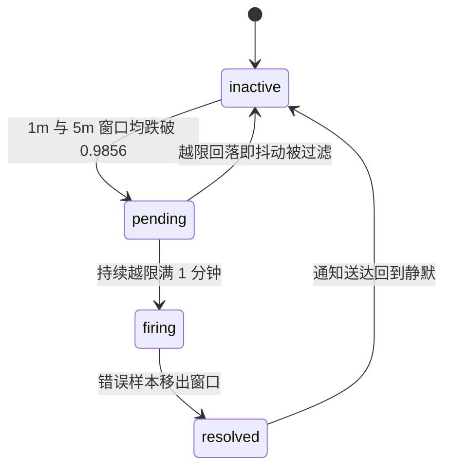

# SLO 告警哑火 3 个月：公式少个 1-，错误率烧到 98.56% 才响

配好那天我挺得意：多窗口、双档位、recording rules 一应俱全，教科书级别的 burn rate 告警。之后三个月零告警，我一度以为服务稳如老狗。

直到这次演练：给服务注入错误，全站可用性掉到 75%，Prometheus 的 `/alerts` 页面安静得像周末的机房——inactive，连 pending 都没有。

根因只有两个字符：阈值表达式少了个 `1-` 前缀。触发条件从“可用性 < 98.56%”变成“可用性 < 1.44%”。两个字符，哑了三个月。修复后重新注入，2 分 57 秒 firing。

## 一、这个 bug 长什么样：语法全对，语义全错

背景一句话：内部服务 `slo-demo`，可用性 SLO 99.9%、30 天窗口，SLI 已用 recording rule 固化成命名序列，告警只引用名字。问题出在比较表达式上：

```promql
# 我写的（错误版本）
slo:slo_demo_availability:ratio_rate5m < (1 - 0.999) * 14.4
```

看起来人畜无害对吧？算一下这个阈值：

```text
(1 - 0.999) * 14.4 = 0.001 * 14.4 = 0.0144
```

也就是说，可用性要跌破 **0.0144** 告警才肯看一眼。翻译成人话：**98.56% 的请求都在报错**，它才触发。正确写法是先把燃烧率阈值换算回可用性再比较：

```promql
# 正确版本：先减再比
slo:slo_demo_availability:ratio_rate5m < 1 - (1 - 0.999) * 14.4
```

| 版本 | 阈值 | 触发条件 | 人话 |
|---|---|---|---|
| 错误 | 0.0144 | 可用性 < 1.44% | 错误率超 98.56%，基本全停 |
| 正确 | 0.9856 | 可用性 < 98.56% | 错误率超 1.44% 持续燃烧 |

1.44% 和 98.56%，差 68 倍。错误率 50% 的故障——用户早就炸锅那种——在错误公式眼里“还不够格”。

## 二、为什么它能潜伏三个月

这个 bug 阴就阴在：语法级的校验全是绿的。

- **promtool check rules 只验语法。** `<` 两边都是合法 PromQL，校验直接过；
- **`health=ok` 只证明规则在跑。** 不证明阈值合理；
- **告警不响没人追。** 没人会主动去审一条从没响过的规则；
- **最坑的：0.0144 不是乱数。** 它恰好是“错误率空间”里的正确阈值——如果 SLI 记录的是错误率，这个数就对。

```bash
promtool check rules slo-lab-rules.extract.yml   # CRD 先剥出 spec.groups 再喂，剥法见第七节
# Checking slo-lab-rules.extract.yml
#   SUCCESS: 22 rules found
```

准确地说，绿掉的只是语法级校验。promtool 其实还有个 `test rules` 子命令，能给告警写单元测试——一条“可用性 0.97 时应 firing”的断言就能当场掀出这个 bug。我当时没写，现在它是第七节的第三条纪律。

> **阈值住错了空间。**

我拿错误率空间的阈值，去卡可用性空间的指标。

## 三、两个空间，差一次 `1-` 翻转

一行补课：30 天窗口、99.9% 目标，error budget = 43.2 分钟“全停等价时间”；burn rate = 实际错误率 ÷ 允许错误率，衡量预算多快烧完，fast 档阈值 14.4，约 2 天烧光全部预算（14.4 和 6 的来历见文末附录，不影响理解下面的修复）。

燃烧率活在**错误率空间**，而 recording rule 记录的是**可用性比率**，两个空间差一次翻转：

| 空间 | 换算 | 数值 |
|---|---|---|
| 错误率空间 | 0.001 × 14.4 | **0.0144** ← 燃烧率阈值本来住在这 |
| 可用性空间 | 1 - 0.0144 | **0.9856** ← 你的指标记录在这 |

所以正确公式永远是：**可用性 < 1 - (1 - 目标) × burn**。乘 burn 之前先 `1-`，比较之前再 `1-`。

顺带堵一个杠点：Sloth、Pyrra 这类工具生成的 SLI 本来就活在错误率空间，没这个坑。但存量环境里大量手写规则记的是可用性比率——这篇治的是存量。

## 四、修复后的完整告警配置

修好的 PrometheusRule 长这样（节选关键部分）：

```yaml
apiVersion: monitoring.coreos.com/v1
kind: PrometheusRule
metadata:
  name: slo-demo-slo
  namespace: monitoring
  labels:
    release: prom   # ruleSelector 要求，release 名以官方文档为准
spec:
  groups:
    - name: slo-demo.recording
      interval: 30s
      rules:
        - record: slo:slo_demo_requests:rate5m
          expr: sum(rate(demo_http_requests_total[5m]))
        - record: slo:slo_demo_errors:rate5m
          expr: sum(rate(demo_http_requests_total{code=~"5.."}[5m]))
        - record: slo:slo_demo_availability:ratio_rate5m
          expr: 1 - slo:slo_demo_errors:rate5m / clamp_min(slo:slo_demo_requests:rate5m, 1e-10)
        # 1m/30m/1h/6h 窗口同构，窗口做后缀，此处省略
    - name: slo-demo.alerts
      rules:
        - alert: SloDemoAvailabilityFastBurn
          expr: |
            (
              slo:slo_demo_availability:ratio_rate1h < 1 - (1 - 0.999) * 14.4
              and
              slo:slo_demo_availability:ratio_rate5m < 1 - (1 - 0.999) * 14.4
            )
          for: 2m
          labels:
            severity: page
            slo: slo-demo-availability
        # 演练专用短窗口告警：验证链路用，生产必须删
        - alert: SloDemoAvailabilityBurnLabFast
          expr: |
            (
              slo:slo_demo_availability:ratio_rate5m < 1 - (1 - 0.999) * 14.4
              and
              slo:slo_demo_availability:ratio_rate1m < 1 - (1 - 0.999) * 14.4
            )
          for: 1m
          labels:
            severity: warning
            slo: slo-demo-availability
            lab_only: "true"
```

两个细节。`clamp_min(..., 1e-10)` 防无流量时除零得 NaN——无流量时可用性保持 1，不误报。

多窗口是拿 AND 做过滤：长窗口（1h）越限排除偶发抖动，短窗口（5m）同时越限确认“现在还在烧”，再撑过 `for: 2m` 才 firing，用及时性换极低误报率。

## 五、实弹验证：2 分 57 秒 firing

> **没被实弹打过的告警等于不存在。**

修完不能只看 `/rules` 变绿。被测服务自带故障注入端点，一条命令开打：

```bash
# 注入 50% 错误率（exec deploy/ 只打到两个副本之一，聚合错误率约 25%，burn ≈ 250，是 14.4 阈值的 17 倍，越限绰绰有余）
date '+%F %T'
kubectl -n slo-demo exec deploy/slo-demo -- python3 -c \
  "import urllib.request as u; print(u.urlopen('http://127.0.0.1:8000/set?fail_rate=0.5&latency_ms=0').read().decode())"
# {"fail_rate": 0.5, "latency_ms": 0}
```

另开终端盯状态（NodePort 以你的安装为准），两步走，别把转义挤在一行里：

```bash
NODE_IP=$(kubectl get nodes -o jsonpath='{.items[0].status.addresses[?(@.type=="InternalIP")].address}')

watch -n 10 "curl -s http://${NODE_IP}:30900/api/v1/alerts | python3 -m json.tool"
```

注意：这个 API 只吐 pending/firing 的活动告警，**列表为空就是 inactive**；想看全状态去 UI 的 `/alerts` 页。下面的时间线按 UI 口径记录，数值是按 25% 聚合错误率换算的理论值，实测会因抓取间隔有小幅偏差：

| 时刻 | ratio_rate1m | ratio_rate5m | 告警状态 |
|---|---|---|---|
| t+0 | ~1.00 | ~1.00 | inactive（注入 fail_rate=0.5） |
| t+45s | ~0.81 | ~0.96 | inactive（条件其实已满足，见下） |
| t+90s | ~0.75 | ~0.93 | pending（两个窗口均 < 0.9856） |
| t+2m57s | ~0.75 | ~0.85 | firing（for: 1m 满足） |

t+45s 那行值得多说一句：5m 窗口攒够 1.44% 的错误，按 25% 聚合错误率算只需约 17 秒——它早就越限了。状态没变不是窗口“没泡透”，是 30s 抓取间隔加上两级各 30s 的 recording rule 链路，把状态传导拖后了。阈值越线是算术，告警状态是流水线：pending 之后还要持续越限满 `for: 1m`、再对上一个 30s 评估拍，实测 2 分 57 秒 firing。

看清楚 0.9856 这条线：两个窗口都得压到它以下才 pending。换成错误公式，这条线在 0.0144，注入到天荒地老也够不着。

恢复现场，确认告警会自己好：

```bash
kubectl -n slo-demo exec deploy/slo-demo -- python3 -c \
  "import urllib.request as u; print(u.urlopen('http://127.0.0.1:8000/set?fail_rate=0&latency_ms=0').read().decode())"
```

约 5~6 分钟后告警转 `resolved`。完整的状态流转长这样：



inactive → pending → firing → resolved 完整闭环，这才叫配好了。

## 六、一个容易误会的现象

演练时 firing 的是短窗口的 `BurnLabFast`，生产档位 `FastBurn` 反而慢几分钟——这不是 bug，是设计。

1h 窗口会稀释注入的错误：聚合 25% 错误率下，要在 1h 窗口里累计到 1.44% 以上约需 4 分钟才 pending，再等 `for: 2m` 才 firing，秒级尖峰凑不够这个量。

长窗口本来就该“钝”——过滤的正是不值得半夜叫醒你的抖动；代价是恢复最长约 1 小时。

所以验证用短窗口、生产靠长窗口，别混用；演练告警记得删，我加了 `lab_only` 标记方便自查。

## 七、防复发清单

踩坑之后我给自己定了五条纪律：

| 纪律 | 具体做法 |
|---|---|
| 阈值先算数 | 每个告警阈值在 UI 单独求值一次，核对数字是否符合直觉 |
| page 必须实弹 | page 级告警上线前注入故障，亲眼看到 firing 再算完成 |
| 告警要单测 | 用 promtool test rules 写“可用性 0.97 时应 firing”的最小用例（见下） |
| 评审问错误率 | 必问“这个阈值折合错误率多少”，暴露空间不匹配 |
| SLI 固化 | recording rule 固化 SLI，告警只引用名字，改公式只改一处 |

单测的最小用例长这样。先提醒一句：promtool 不认 CRD 外壳，得把 `spec.groups` 段剥成纯规则文件（`check rules` 同理）：

```bash
sed -n '/^  groups:/,$p' slo-rules.yaml | sed 's/^  //' > slo-lab-rules.extract.yml
```

```yaml
# test_slo_rules.yaml —— rule_files 指向剥出的纯规则文件，不是 CRD 本身
rule_files: [slo-lab-rules.extract.yml]
tests:
  - interval: 30s
    input_series:
      - series: 'slo:slo_demo_availability:ratio_rate5m'
        values: '0.97x8'   # 可用性 97%，持续 4 分钟
      - series: 'slo:slo_demo_availability:ratio_rate1m'
        values: '0.97x8'
    alert_rule_test:
      - eval_time: 3m
        alertname: SloDemoAvailabilityBurnLabFast
        exp_alerts:
          - exp_labels:
              severity: warning
              slo: slo-demo-availability
              lab_only: "true"
```

```bash
promtool test rules test_slo_rules.yaml
```

可用性 0.97 < 0.9856，正确公式下这条用例 PASS；错误公式下阈值是 0.0144，0.97 永远够不着，用例当场红。“语法正确、语义离谱”的自动化盲区，就这么一条用例堵上。

第一条成本 10 秒，恰好拦住大部分手滑；第三条是这次事故唯一能提前报警的自动化手段。

## 八、现在就能做的一件事

打开 Prometheus UI，把你的告警阈值单独拎出来跑一遍：

```promql
# 应该得到 0.9856；如果得到 0.0144，恭喜，本文就是为你写的
1 - (1 - 0.999) * 14.4
```

再扫一遍存量规则，“`<` 直接跟括号”的行都值得人工过一遍：

```bash
# 本地 yaml
grep -rn --include='*.yaml' -E '<\s*\(' your-rules-dir/
# Helm / K8s 集群侧（PrometheusRule CRD）
kubectl get prometheusrules -A -o yaml | grep -nE '<\s*\('
```

扫出可疑行的，评论区贴出来，大家一起算它真实的越限线。

如果结果不对，别犹豫，今天就修，然后注入一次故障验证它真的会响。

本文的完整实验（自带 `/set` 注入端点的脚手架服务、双档位告警模板、十项验收的判分脚本）整理在开源仓库 [sre-learning-hub](https://github.com/Thneoly/sre-learning-hub) 的 SLO workshop lab 里，拉到测试集群实跑一遍，比看十遍公式记得牢。

本系列前几篇：《照着 CKS 教材做实验，把 apiserver 干瘫了 7 分钟》《tcp_tw_reuse=2 配了个寂寞》《kubectl 传个假 token 也能 get nodes》，都在我主页。

最后下个战书：评论区敢不敢晒一下，你 page 级告警上一次实弹验证是什么时候？或者直接贴 `1 - (1 - 目标) × burn` 的求值结果——晒出 0.0144 的，算你中奖。

下篇写 error budget 怎么驱动发布决策。

## 附录：14.4 和 6 是怎么来的

30 天窗口、99.9% 目标，error budget = 0.1% × 43 200 min = 43.2 min。

burn = 1 表示预算刚好 30 天用完；burn = 14.4 表示按当前速度 30 / 14.4 ≈ 50 小时，约 **2 天烧光**全部预算；burn = 6 则是 5 天。这就是两个档位的由来：

| 档位 | burn 阈值 | 预算耗尽时间 | 窗口对 | 动作 |
|---|---|---|---|---|
| fast | 14.4 | ≈ 2 天 | 1h + 5m | page |
| slow | 6 | = 5 天 | 6h + 30m | ticket |

这套 14.4 / 6 的组合出自 Google SRE 工作簿（Workbook），社区通用配置。
