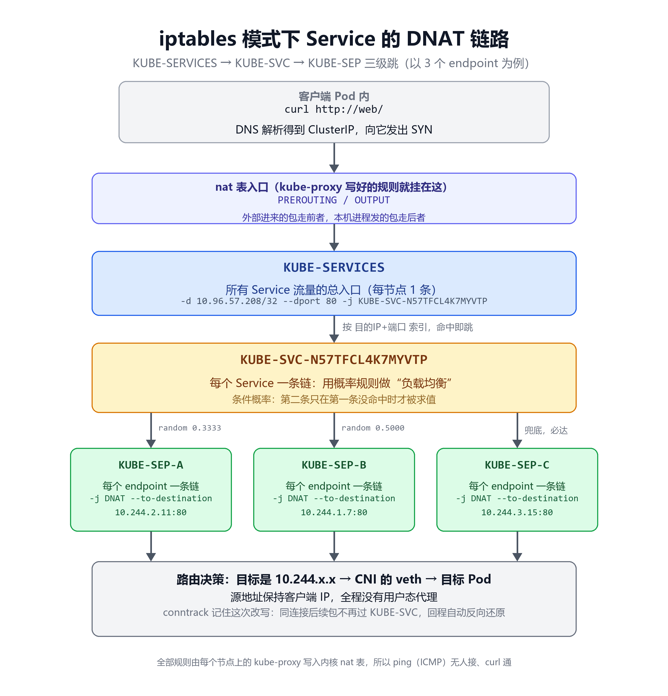

# ClusterIP 根本不在网卡上——一道让答 eth0 的人当场沉默的面试题

我第一次被问"ClusterIP 挂在哪张网卡上"时，答的也是 eth0。后来不服气，在节点上 `ip addr` 翻了半天，最后得出的结论是——**这个 IP 是假的。**

它确实"不存在"，但流量每次都能到。这不是玄学，是 kube-proxy 写在内核里的一套 netfilter 规则在干活。今天我们把这层窗户纸捅破：把 `KUBE-SERVICES` → `KUBE-SVC` → `KUBE-SEP` 这条 DNAT 链路，一级一级亲手读出来。

读完这篇你能带走三样东西：一张能默画的链路图、一套能直接复制的验证命令、以及 iptables 和 ipvs 两种模式该怎么选的判断依据。

## 一、先看见怪事

结论先按下不表，亲手撞一次这个怪事再说。挑一个你们集群里活着的 ClusterIP 类型的 Service（暂时没有集群？跳到下一节，十分钟拉一个再回来），在任意节点上依次执行：

```bash
kubectl get svc -A              # 挑一个 ClusterIP 类型的 Service，记下它的 IP 和端口
SVCIP=10.96.57.208              # ← 换成你刚挑的那个 IP，本文示例用它
ip addr  | grep "$SVCIP"        # 空输出：不在任何网卡上
ip route | grep "$SVCIP"        # 还是空：路由表里也没有它
curl -sm3 -o /dev/null -w '%{http_code}\n' "http://$SVCIP"    # 端口按你挑的 Service 来
```

最后一条哪怕吐出来的是 404，也算通——TCP 能建连，说明这个"不存在"的 IP 收得到包。

**一个 IP 不在任何网卡上、不在路由表里，却能正常收发包——这在传统网络课程里是悖论，在 K8s 里是日常。**

怪事的答案不在网卡上，在内核里。先花几分钟把实验环境搭好，马上回去给它一个完整的解释。

## 二、搭个最小实验环境

铺垫压缩成两句：Pod IP 是易失的，崩溃重建、滚动更新、节点故障重调度都会换 IP，把 Pod IP 写死进配置等于埋雷；所以 K8s 给了一层不变的虚拟 IP 加 label selector 动态圈后端，在四层分发流量——而这层 IP 能"虚拟"到什么程度，你上一节已经亲眼见过了。注意它不是七层代理，本质就是接下来要拆的 netfilter DNAT 规则。

三条命令，一个 namespace、三个 nginx 副本、一个 ClusterIP Service。有现成集群的直接跟着敲，没有的花十分钟用 kubeadm 拉一个：

```bash
kubectl create ns netlab
kubectl -n netlab create deployment web --image=nginx:alpine --replicas=3
kubectl -n netlab expose deployment web --port=80 --target-port=80 --name=web
kubectl -n netlab wait --for=condition=Available deployment/web --timeout=120s
kubectl -n netlab get svc,pod -o wide
```

输出大致长这样（节选，`-o wide` 还会带出 Pod 表和更多列，IP 以你集群实际输出为准）：

```text
NAME   TYPE        CLUSTER-IP     EXTERNAL-IP   PORT(S)   AGE
web    ClusterIP   10.96.57.208   <none>        80/TCP    10s
...
```

三个 Pod 各有一个 10.244.x.x 的 IP，由 CNI 分配。注意这两段地址的区别，后面全靠它撑起核心论点：

- Pod CIDR（10.244.0.0/16）：真实地址，配在 Pod netns 内的 eth0（veth 的 Pod 端）。节点上 `ip addr` 同样看不到它——宿主机侧的 veth 不配 IP；想亲眼看，要么 `nsenter -t <PID> -n ip addr` 进 Pod 的网络命名空间，要么看 `ip route` 里指向各个 Pod 的路由
- Service CIDR（10.96.0.0/12）：**虚拟地址段，不分配给任何设备，只活在规则里**

网段以你实际 CNI 配置为准：10.244.0.0/16 是 kubeadm/Flannel 的默认，Calico 官方 manifest 默认是 192.168.0.0/16。

顺手把自己集群的 Service CIDR 查出来。第一条只对 kubeadm 集群有效，k3s/Rancher、云托管（ACK/EKS 等）没有这个 ConfigMap，用第二条从 apiserver 启动参数兜底：

```bash
kubectl -n kube-system get cm kubeadm-config -o yaml | grep -E 'serviceSubnet|podSubnet'   # kubeadm 集群
kubectl cluster-info dump | grep -m1 service-cluster-ip-range                              # 通用兜底
```

## 三、谁接住了这个"不存在"的 IP

第一节的怪事，现在可以给答案了：**ClusterIP 不属于任何网卡，它活在每个节点 nat 表的规则里。**整个机制靠三方分工：

- kube-proxy：每个节点上的"规则编写器"，watch Service 和 EndpointSlice 的变化，把规则写进内核 nat 表。它自己不在数据路径上，一个包都不会经它手
- netfilter：内核里真正干活的，负责在包经过时改写目标地址（DNAT）
- conntrack：连接跟踪表，记住"这条连接被改写成了什么"，保证后续包走同一条路

于是一个包的完整人生是这样的：客户端进程查 DNS 得到 ClusterIP → 发 SYN 到 10.96.57.208:80 → 包进入节点网络栈 → nat 表规则把目标地址改写成某个 Pod IP → 路由决策送到那个 Pod。全程没有用户态代理。

补一块拼图：规则是怎么跟上集群变化的。Pod 扩容一个，kube-proxy 在 watch 到 EndpointSlice 变化后，就在本节点给对应的 `KUBE-SVC` 链补一条概率规则、新建一条 `KUBE-SEP` 链；Pod 被摘除就反向删掉。控制面走 API，数据面走内核，两边各干各的，互不等待。

这也解释了一个经典怪象：ping 不通 ClusterIP，但 curl 通。因为 kube-proxy 只对 Service 端口的 TCP/UDP 写了规则，ICMP 没人接。**ping 不通、curl 通，是预期行为，不是故障。**验证 Service 请用 curl 或 nc，别用 ping，省得误报。

顺带说一句，ipvs 模式下 ping 反而是通的——因为 VIP 真的绑在一个叫 `kube-ipvs0` 的 dummy 接口上。同一个"虚拟 IP"，两种实现给出了相反的 ping 行为，这个对比本身就很有味道。

## 四、四级链条：亲手把规则读出来

先上完整链路图，建议存下来对着自己集群读：



ASCII 文字版，复现党直接抄：

```text
Pod 内 curl http://web/ → DNS 得 10.96.57.208 → 发 SYN 到 10.96.57.208:80
    │
    ▼
nat 表 PREROUTING（其它节点/外部进来的包）
nat 表 OUTPUT    （本机进程发出的包，两条路都汇入下面）
    └─► KUBE-SERVICES                  ← 所有 Service 流量总入口
         └─► -d 10.96.57.208/32 --dport 80 -j KUBE-SVC-N57TFCL4K7MYVTP
              └─► KUBE-SVC-*           ← 每个 Service 一条链，做"负载均衡"
                   --mode random --probability 0.3333 -j KUBE-SEP-A
                   --mode random --probability 0.5000 -j KUBE-SEP-B
                   -j KUBE-SEP-C        ← 兜底，前两条没中必走 C
                        └─► KUBE-SEP-*  ← 每个 endpoint 一条链，做 DNAT
                             -j DNAT --to-destination 10.244.2.11:80
    │
    ▼ 路由决策：目标 10.244.x.x → CNI 的 veth → 目标 Pod，源地址保持客户端 IP
```

先解释每一级是干嘛的，不然光看图记不住：

| 链 | 数量 | 角色 |
|---|---|---|
| `KUBE-SERVICES` | 每节点 1 条 | 总入口，按"目的 IP + 端口"索引到具体 Service 链 |
| `KUBE-SVC-*` | 每 Service 1 条 | 负载均衡器，用概率规则把流量分给 endpoint 链 |
| `KUBE-SEP-*` | 每 endpoint 1 条 | 转发表，SEP = Service Endpoint，做真正的 DNAT |

有个坑要提前说：`KUBE-SVC` 和 `KUBE-SEP` 的后缀都是"namespace/name"加协议端口哈希出来的，肉眼看不出对应哪个 Service。好在 kube-proxy 在规则里写了 comment 注释，反查很容易：

```bash
iptables-save -t nat | grep 'netlab/web' | head -3
# comment 里直接写着 "netlab/web:http"，链名后缀跟着就出来了
```

Service 几百个的生产集群上，先靠 comment 反查链名，再顺着链名往下读，比肉眼扫 `KUBE-SERVICES` 快得多。

下面逐级读。第 1 级，找到谁匹配这个 ClusterIP：

```bash
SVCIP=$(kubectl -n netlab get svc web -o jsonpath='{.spec.clusterIP}')
echo "ClusterIP=$SVCIP"

iptables-save -t nat | grep -- "-d $SVCIP/32" | head -2
# -A KUBE-SERVICES -d 10.96.57.208/32 -p tcp ... --dport 80 -j KUBE-SVC-N57TFCL4K7MYVTP
```

第 2 级，看负载均衡链。加 `-v` 能看到随机规则的命中计数：

```bash
SVCCHAIN=$(iptables-save -t nat | grep -- "-d $SVCIP/32" | grep -oE 'KUBE-SVC-[A-Z0-9]+' | head -1)
iptables -t nat -L "$SVCCHAIN" -n -v
```

三个 endpoint 时，能看到两条 random 规则加一条兜底跳转，每行跳向一个 `KUBE-SEP`。第 3 级，随便挑一条 endpoint 链看 DNAT 目标：

```bash
SEP=$(iptables -t nat -S "$SVCCHAIN" | grep -oE 'KUBE-SEP-[A-Z0-9]+' | head -1)
iptables -t nat -S "$SEP"
# -A KUBE-SEP-... -p tcp ... -j DNAT --to-destination 10.244.2.11:80
```

`--to-destination` 就是某个 Pod 的真实 IP:port。**所谓 Service 转发，到内核这层就是一条 DNAT 规则。**没有 envoy、没有 nginx、没有任何用户态进程，性能开销就是几次规则匹配。

空口无凭，多打些请求再回来看计数。10 次太少，出现 5/3/2 之类的偏差纯属正常，起码打满 100 发：

```bash
for i in $(seq 1 100); do curl -s -o /dev/null -m 3 "http://$SVCIP"; done
iptables -t nat -L "$SVCCHAIN" -n -v
```

两条 random 规则加一条兜底规则的 pkts 都在涨，样本量上来后大致均分；等不及就把三条 `KUBE-SEP` 链分别 `-L` 一遍，直接对比各自的计数。再用日志实锤流量确实散到了三个 Pod：

```bash
kubectl -n netlab logs -l app=web --prefix=true --tail=3
```

三个不同 Pod 名都出现 GET，链路验证闭环。到这里，你已经把面试官想听的整张图画完了。

## 五、为什么是 0.3333 和 0.5000，不是三条 0.3333

这是整条链路里最精妙（也最常被面到）的一笔。iptables 规则是顺序执行的：第二条只有在前一条没命中时才被求值。

如果三条都写 0.3333，实际分布会算成这样：

| 规则 | 命中概率 | 说明 |
|---|---|---|
| 第一条 0.3333 | 1/3 | 直接命中 |
| 第二条 0.3333 | 2/3 × 1/3 = 2/9 | 得先躲过第一条 |
| 第三条兜底 | 4/9 | 前两条都没中的全落这 |

**1/3、2/9、4/9，严重倾斜。**写成条件概率 1/3、1/2、兜底必达，三者才是干净的 1/3、1/3、1/3。

这叫概率级联，不是三次独立抽样。endpoint 数量一变，kube-proxy 会整组重写概率：4 个 endpoint 就是 0.2500、0.3333、0.5000、兜底，数学期望永远均等。

## 六、conntrack：一条连接永远粘在同一个 Pod 上

很多人以为每个请求都要过一遍随机规则。不是。DNAT 只发生在 conntrack 建立新连接的那一刻，同一连接的后续报文直接按连接表反向改写，根本不再经过 `KUBE-SVC`。

亲眼看一下这张表。节点上没有 conntrack 命令的先装一下：`apt-get install -y conntrack`（其它发行版按各自的包管理器来）：

```bash
conntrack -L -p tcp --dport 80 2>/dev/null | grep "$SVCIP" | head -3
```

一行里能同时看到改写前的去程目标（original 方向的 dst=ClusterIP:80）和改写后的回程源（reply 方向的 src=PodIP:80）——这条连接的映射关系就靠这一对编码，回程按它反向还原，客户端全程无感。

这带来两个推论，都很实用：

- **负载均衡的粒度是"连接"不是"请求"。**HTTP keep-alive 一条连接上的成百上千个请求，全落在同一个 Pod
- 滚动更新期间偶发失败的经典原因之一：客户端的长连接在 conntrack 表里还指向旧 Pod，Pod 删了表项没过期，流量继续发往已不存在的 IP

第二种情况的应急动作是清连接表（生产上慎用，理解机制为主）：

```bash
conntrack -D -p tcp --dport 80 2>/dev/null | head -3
```

再延伸一句：发布时想让旧连接体面退出，正确姿势是靠 readinessProbe 先把 Pod 从 Endpoints 摘掉、等客户端连接自然衰减，而不是指望 conntrack 立刻失效——**它不懂发布，只认超时。**

## 七、为什么是随机选一，不是轮询

面试追到概率级联，基本就到头了，但这个反直觉的点值得再多想一步：既然目标是均分，为啥不直接轮询？两个层面都决定了轮询不可行。

规则层：iptables 是无状态匹配器，`statistic` 模块虽有 `nth`（轮询）模式，但它撑不起真轮询——

- 计数器每节点独立，跨节点没有共享状态
- Endpoints 一变，kube-proxy 就整链重写，计数清零
- 两头一叠加，"轮"出来的分布立刻失真

语义层：如上节所说，"轮"的只能是新连接，对 keep-alive 场景毫无意义。

无状态的随机规则在数学期望上均等、在每台节点上独立可复现，**已经是纯规则集能做到的最优解**。真正的 `rr`/`wrr`/`lc` 调度器由 IPVS 提供——这也是很多大规模集群切 ipvs 的真实原因：不是赶时髦，是被规则数逼的。

链路和原理到这就闭环了。但链路上还埋着几个坑，专挑你没防备的时候咬人——先说最怪的一个。

## 八、一个彩蛋：hairpin 与 `KUBE-MARK-MASQ`

先看一起"案子"：有同事排障时发现，Pod 通过 Service 调用自己，对端日志里记的客户端 IP 却是节点的 IP，第一反应都是"链路上有中间人？"。真凶就是 `KUBE-MARK-MASQ`。

每条 `KUBE-SEP` 链里都有一条 `-s <PodIP>/32 -j KUBE-MARK-MASQ`，平时静默，只在源 Pod 命中自己（hairpin：DNAT 后源 Pod 恰好等于目标 Pod）时才匹配——这种场景下回程会被当成直连而错乱，所以要给这类包打上标记，在 `KUBE-POSTROUTING` 做 MASQUERADE，把源地址改成节点 IP。**Pod 通过 Service 访问自己时，对方看到的源 IP 必然是节点 IP**，知道这个现象，排障时就不会怀疑人生。

顺带说清一个容易误会的点：`KUBE-MARK-MASQ` 不是 hairpin 专属。NodePort 外部流量、开了 `masquerade-all` 的情况下，`KUBE-NODEPORTS`、`KUBE-SERVICES` 里也会出现它，干的都是同一件事——先打标记，留给出口统一做源地址伪装。

## 九、NodePort 多的那一跳

如果把 Service 改成 NodePort，链路只多一跳：`KUBE-NODEPORTS`。它挂在 `KUBE-SERVICES` 的尾部，专门匹配"目的端口 = nodePort"的流量，然后汇入同一条 `KUBE-SVC` 链：

```bash
kubectl -n netlab expose deployment web --type=NodePort --port=80 --name=web-np
NP=$(kubectl -n netlab get svc web-np -o jsonpath='{.spec.ports[0].nodePort}')
NODEIP=$(kubectl get nodes -o jsonpath='{.items[0].status.addresses[?(@.type=="InternalIP")].address}')
curl -s -o /dev/null -w 'nodeport HTTP %{http_code}\n' "http://$NODEIP:$NP"
iptables-save -t nat | grep -E 'KUBE-NODEPORTS|dport '"$NP" | head -5
```

路径是 `PREROUTING` → `KUBE-SERVICES`（尾部）→ `KUBE-NODEPORTS` → `KUBE-SVC` → DNAT。**看懂了 ClusterIP 的链，NodePort 就是免费送的。**

## 十、iptables vs ipvs：什么时候该换

kube-proxy 有四种模式：userspace（最古老的用户态代理，已废弃）、iptables（默认）、ipvs、nftables（新版本引入，以官方文档为准）。重点对比两种能长期用的：

| 维度 | iptables 模式 | ipvs 模式 |
|---|---|---|
| 规则组织 | 线性链逐条匹配，O(规则数) | 内核哈希表，O(1) 查找 |
| 规则更新 | 全量替换，Service 多时同步慢、锁竞争 | 增量同步（配合 `ipset`） |
| 调度算法 | 仅 `random`（`statistic` 模块） | `rr`/`wrr`/`lc`/`sh`/`sed`/`nq` 任选 |
| 会话保持 | ClientIP 靠 `recent` 模块近似 | 内建 persistent session |
| 观测手段 | `iptables-save -t nat` 读计数 | `ipvsadm -Ln --stats` 每后端计数 |
| 额外依赖 | 无（默认就有） | `ip_vs` 内核模块、`ipset`、`ipvsadm` |
| VIP 归属 | 不在任何接口，ping 通常不通 | 绑在 `kube-ipvs0` 上，ping 通 |

表格干巴巴的，展开讲两个最痛的点。动手之前先确认你集群现在跑的哪种模式，别拿 iptables 命令去查一个 ipvs 集群、白忙一场。注意正常启动日志写的是 `Using iptables Proxier` / `Using ipvs Proxier`，并不含"proxy mode"字样，别 grep 错关键词：

```bash
kubectl -n kube-system logs ds/kube-proxy | grep -im1 -E 'Proxier|Unknown proxy mode'
```

第一个痛，规则组织。iptables 是线性表，匹配从上往下一条条来。Service 一多，`KUBE-SERVICES` 里几千条规则，每个新连接的首包都要扫过前面一长串。IPVS 是内核里的哈希表，一次命中，规则再多查找也是 O(1)。

第二个痛，更新方式。iptables 没有增量修改 API，kube-proxy 每次都只能把整个 nat 表全量替换一遍。Service 几千个时一次同步秒级起步，期间还有锁竞争，集群频繁扩缩容时会感觉到明显的抖动。IPVS 配合 `ipset` 做增量更新，快得多。

**经验值：Service 数上千、或需要真实 LB 调度算法（比如按权重分发、最少连接）时选 ipvs；小集群 iptables 完全够用，规则少时线性匹配的开销感知不到，别为了时髦硬切。**

想亲手摸一下 ipvs，分两步走。第一步装内核模块并持久化（多节点要在每个节点执行）：

```bash
modprobe ip_vs ip_vs_rr ip_vs_wrr ip_vs_sh nf_conntrack
cat >/etc/modules-load.d/ipvs.conf <<'EOF'
ip_vs
ip_vs_rr
ip_vs_wrr
ip_vs_sh
nf_conntrack
EOF
```

模块装好后，第二步切模式：

```bash
kubectl -n kube-system edit cm kube-proxy   # config.conf 里 mode: "" 改为 mode: "ipvs"
kubectl -n kube-system rollout restart ds kube-proxy
kubectl -n kube-system logs ds/kube-proxy | grep -im2 ipvs
```

装上观测工具再看：

```bash
apt-get install -y ipvsadm
ipvsadm -Ln | head -20
ipvsadm -Ln --stats | grep -A3 "$SVCIP" | head -5
```

能看到 Virtual Server 列表和每个后端的连接、包计数——这个观测粒度比读 iptables 计数器舒服多了。切回 iptables 只需把 mode 改回空串再 rollout restart，实验完记得还原，别把实验集群留在中间态。

一个高频事故要预警：切完 ipvs Service 全断。九成是节点没加载 `ip_vs` 模块，回到第一步 modprobe 并确认 modules-load 持久化生效。

## 十一、三个排障场景收尾

场景一：`iptables-save` grep 不到任何 `KUBE-SVC` 规则。先确认 kube-proxy 实际模式——较新的版本允许（部分发行版默认）nftables 模式，规则在 nft 里：

```bash
nft list ruleset | grep -m5 KUBE-SVC
kubectl -n kube-system get cm kube-proxy -o yaml | grep -A3 mode
```

链路语义与 iptables 完全对应，只是观测命令不同，以你集群的 mode 输出为准。

场景二：Service 不通，先看 Endpoints 再怀疑网络：

```bash
kubectl -n netlab describe svc web | grep -A3 'Endpoints\|Selector'
```

`Endpoints: <none>` 说明转发面根本没有后端——selector 失配、Pod 不 Ready、targetPort 名字对不上，三者居其一。**没有 endpoint，kube-proxy 连 `KUBE-SEP` 链都不会写。**这是"选不到 Pod"，和 DNS、kube-proxy、网络策略都无关。

场景三：kubectl get svc 有 IP，链路也读得到，但客户端报源 IP 是节点 IP。先分清成因再动手——是流量走 NodePort/LoadBalancer 进来被跨节点 SNAT 了，还是上一节的 hairpin。前者用 `externalTrafficPolicy: Local` 保源 IP，代价是节点上没有本地 endpoint 时流量会被直接丢掉，是个权衡；后者与 `externalTrafficPolicy` 无关，是必然伪装，要绕开就直连 Pod IP 或改用 headless Service。

一张速查表带走：

| 症状 | 原因 | 解法 |
|---|---|---|
| ping ClusterIP 不通、curl 通 | iptables 模式只写了 TCP/UDP 规则 | 预期行为，用 curl/nc 验证 |
| grep 不到 `KUBE-SVC` 规则 | kube-proxy 跑在 nftables 模式 | 用 `nft list ruleset` 看 |
| Endpoints 为 `<none>` | selector 失配 / 不 Ready / 端口名不匹配 | 按场景二逐步排查 |
| 切 ipvs 后 Service 全断 | `ip_vs` 模块没加载 | 每节点 modprobe 并持久化 |
| 源 IP 是节点 IP（流量走 NodePort/LB 进来） | 跨节点转发的 SNAT | `externalTrafficPolicy: Local`（无本地 endpoint 时丢包） |
| 源 IP 是节点 IP（Pod 调用自己） | hairpin 必然 MASQUERADE | 调 `externalTrafficPolicy` 无效；直连 Pod IP 或用 headless 绕开 |

## 写在最后

回到开头那个面试题，现在你能一句话讲清楚：**ClusterIP 不属于任何网卡，它活在每个节点 nat 表的规则里。**流量经过 `KUBE-SERVICES` → `KUBE-SVC` → `KUBE-SEP` 三级跳，最后一条 DNAT 把包改写到 Pod IP。而 conntrack 保证同一条连接永远粘在同一个 Pod 上。

**现在就能做的事**

登录你的任意节点，把上面这串命令跑一遍，把你们集群某个 Service 的链路亲手读出来。十分钟后，你对 Service 的理解就会超过大多数只背概念的人：

```bash
NS=your-ns; SVC=your-svc    # ← 换成你自己的 namespace 和 Service 名
SVCIP=$(kubectl -n "$NS" get svc "$SVC" -o jsonpath='{.spec.clusterIP}')
iptables-save -t nat | grep -- "-d $SVCIP/32"   # 拿到链名后，回第四节顺着往下读
```

最后留个问题：你们生产上跑的是 iptables 还是 ipvs？Service 数上千了吗？切完 ipvs 是真香还是后悔？或者——你被哪道 K8s 网络面试题挂过？评论区聊聊，曝光它。

这是 K8s 网络系列的第 8 篇，前 7 篇从 Pod 网络一路讲到这，都在我的文章合集里，感兴趣的顺着看。

这一篇整理自我的开源学习仓库 [sre-learning-hub](https://github.com/Thneoly/sre-learning-hub)，里面有成体系的 K8s 基础、CKA/CKS 实验和排障手册。Service 与 DNS 那章还有 headless、CoreDNS 的 ndots:5 陷阱这些没写进来的内容，感兴趣的去看仓库，点个 star 不迷路。
