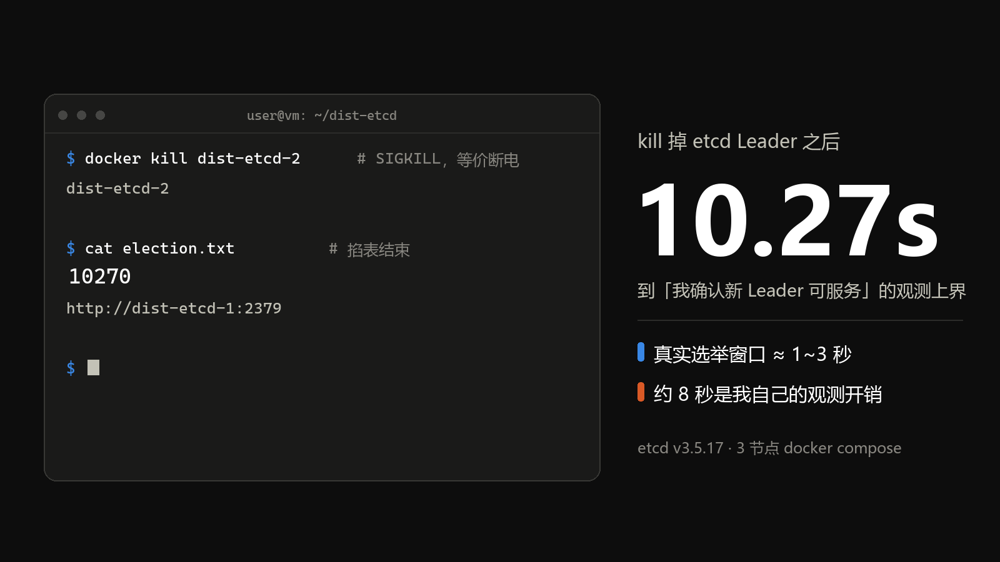
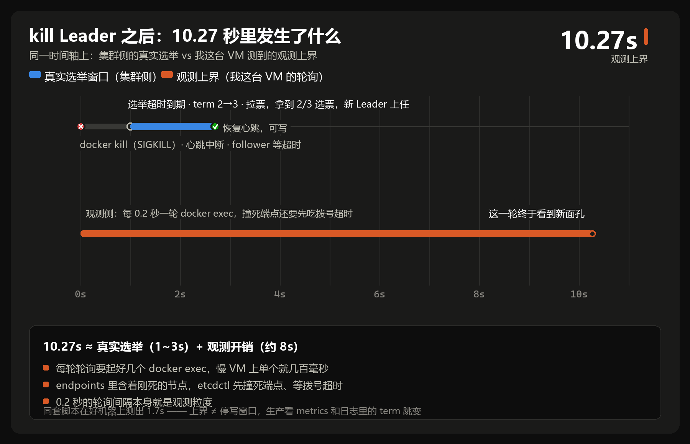
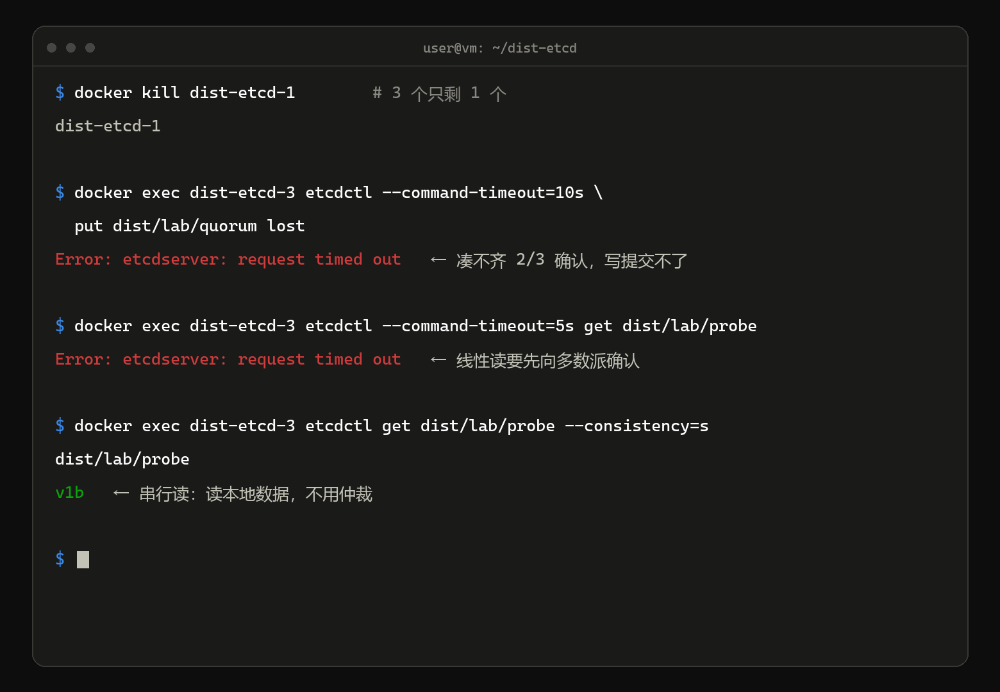

# kill 掉 etcd Leader，我掐表等出 10.27 秒的选举——复盘发现大半是我自己的锅



半夜两点，我亲手 kill 掉了一套 3 节点 etcd 的 Leader，然后掐着表，等了 10.27 秒才确认新 Leader 可服务——这几秒里，K8s 控制面是停写的。

先把丑话说在前头：这 10.27 秒后来被我自己拆了台，复盘发现大半是观测开销，真实选举只有 1~3 秒。但正是这次拆台，把 Raft 从面试时背的名词，变成了我磁盘上一个可观测的现象。

再讲一个更贴近半夜的场景：K8s 批量报 `etcdserver: request timed out`，你的第一反应是不是"赶紧重启 etcd"？先别动手，数一数还活着几台。3 节点 etcd 挂到只剩 1 台时，重启救不了它——那不叫"挂了"，那叫丢了仲裁，正确动作是把失联成员拉回来。（第八节末尾附了一张半夜排障命令卡，冲着救火来的读者可以直接翻过去。）

"丢了仲裁先拉成员、别急着重启"这句话我背了很久，直到上周亲手做完这套实验，它才变成身体记忆。这篇记录全过程：选举实测耗时（以及它为什么被注水）、丢 quorum 的报错原文，和一场教科书级的"线性读 vs 串行读"对比。

读完你会有三样东西：一套可以反复摧残的演练环境、几个亲手测出来的数字、以及下次半夜报警时的第一反应。

## 一、为什么值得专门折腾一次

生产 K8s 的控制面状态全在 etcd 里，但那是 kubeadm 的静态 Pod，没人敢拿来杀。我在一台 Ubuntu VM 上用 docker compose 起了套一次性的 3 节点 etcd，专门做故障注入。

选 etcd 不选别的共识系统，因为它是离 K8s 运维最近的一个：apiserver 的每次写、kubelet 的每次感知，背后都是它。它出的问题，会原样变成你控制面的问题。

3 这个数字不是随手选的，Raft 的多数派 = `N/2+1`，直接决定你能死几台：

| 集群规模 | 多数派 | 可容忍故障 | 备注 |
|---|---|---|---|
| 3 | 2 | 1 | 最小高可用单元 |
| 4 | 3 | 1 | 多一台待确认，不划算 |
| 5 | 3 | 2 | 想要 2 台容错直接上 5 |

这也是各种共识系统部署建议都是"奇数台"的原因：4 节点花 4 台机器的钱，买到的容错和 3 节点一样。

先把 etcd 的读写模型压成三句话：写走 Leader、提交看多数派、读默认线性。这篇的所有现象都是这三句话的推论——杀 Leader 影响写、丢多数派卡提交、线性读要仲裁。

我要用它回答三个问题：

1. 杀掉 Leader 后，集群停写多久？
2. 杀到只剩 1/3，写报什么错？读还能读吗？
3. 节点拉回来后，集群能自愈吗？

## 二、起一套一次性的集群

镜像用 quay 上的 coreos/etcd（我用 v3.5.17，tag 以官方仓库为准）。三个成员参数完全对称，`--name` 与 `container_name` 同名，peer 之间靠容器 DNS 互访。etcd1 长这样：

```yaml
# ~/dist-etcd/compose.yaml 的 etcd1 成员；etcd2/etcd3 仅把 1 换成 2/3，其余逐字相同
x-etcd-common: &etcd-common
  image: ${ETCD_IMAGE:-quay.io/coreos/etcd:v3.5.17}
  networks: [dist-net]

services:
  etcd1:
    <<: *etcd-common
    container_name: dist-etcd-1
    command:
      - etcd
      - --name=dist-etcd-1
      - --data-dir=/etcd-data
      - --listen-client-urls=http://0.0.0.0:2379
      - --advertise-client-urls=http://dist-etcd-1:2379
      - --listen-peer-urls=http://0.0.0.0:2380
      - --initial-advertise-peer-urls=http://dist-etcd-1:2380
      - --initial-cluster=dist-etcd-1=http://dist-etcd-1:2380,dist-etcd-2=http://dist-etcd-2:2380,dist-etcd-3=http://dist-etcd-3:2380
      - --initial-cluster-state=new
      - --initial-cluster-token=dist-etcd-lab

networks:
  dist-net:
    name: dist-etcd-net
    driver: bridge
    ipam:
      config:
        - subnet: 172.29.0.0/24
```

三个成员的完整文件放在文末附录（约 60 行，可整段复制），也可以直接从仓库搬，那边的 lab 自带验收脚本。

启动并确认：

```bash
mkdir -p ~/dist-etcd && cd ~/dist-etcd
docker compose -p dist-etcd up -d
docker ps --format '{{.Names}}\t{{.Status}}'
```

注意 `--initial-cluster` 三个成员必须写得完全一致；子网固定在 `172.29.0.0/24` 是为了避开我机器上别的实验，你环境没冲突可以不写 ipam。

两个小经验：镜像拉不动时 `export ETCD_IMAGE=gcr.io/etcd-development/etcd:v3.5.17` 换官方发布位置，参数完全一致；重做实验前删掉上一轮的记录文件，不然脚本会读到旧 Leader，白测一轮。

端口分工顺便记一下：2379 对客户端（etcdctl、apiserver），2380 对 peer（成员间心跳与日志复制）。kill Leader 掐断的就是 2380 上的心跳流。

## 三、先找到 Leader 是谁

一会儿 Leader 可能恰好是被杀的那个，所以 etcdctl 得从还活着的容器里发起。顺便偷个懒：容器里自带 etcdctl，宿主机就不用装了。我写了两个函数，逐个容器试：

```bash
cat > ~/dist-etcd/env.sh <<'EOF'
etcdctl_all() {
  local c
  for c in dist-etcd-1 dist-etcd-2 dist-etcd-3; do
    if docker exec "$c" etcdctl \
      --endpoints=http://dist-etcd-1:2379,http://dist-etcd-2:2379,http://dist-etcd-3:2379 \
      "$@" 2>/dev/null; then
      return 0
    fi
  done
  return 1
}
etcd_leader() {
  etcdctl_all endpoint status -w table 2>/dev/null | grep -w true | awk '{print $2}' | head -1
}
EOF
. ~/dist-etcd/env.sh
etcdctl_all endpoint status -w table
```

输出长这样（v3.5.17 的完整 10 列；谁是 Leader 由内部投票决定，你的环境未必是同一台。成员 ID 由 peer URL 加 cluster token 确定性哈希而来，照抄这套配置你会得到一模一样的三个 ID）：

```text
+--------------------------+------------------+---------+---------+-----------+------------+-----------+------------+--------------------+--------+
|        ENDPOINT          |        ID        | VERSION | DB SIZE | IS LEADER | IS LEARNER | RAFT TERM | RAFT INDEX | RAFT APPLIED INDEX | ERRORS |
+--------------------------+------------------+---------+---------+-----------+------------+-----------+------------+--------------------+--------+
| http://dist-etcd-1:2379  | f64e29b9e156afdb |  3.5.17 |  20 kB  |   false   |   false    |         2 |         13 |                 13 |        |
| http://dist-etcd-2:2379  | 07c756eb659952fc |  3.5.17 |  20 kB  |   true    |   false    |         2 |         13 |                 13 |        |
| http://dist-etcd-3:2379  | 646fc73c9e2acd7b |  3.5.17 |  20 kB  |   false   |   false    |         2 |         13 |                 13 |        |
+--------------------------+------------------+---------+---------+-----------+------------+-----------+------------+--------------------+--------+
```

我这轮的 Leader 是 dist-etcd-2。解析有个小坑：表格行以竖线开头，endpoint 在第 2 列，awk 要取 `$2`；`grep -w true` 只会命中 IS LEADER 列。

顺便认识两列：RAFT TERM 是任期号，每次选举加一；RAFT INDEX 是日志位置。后面判断"有没有发生选举"，盯 term 跳变就行。把结果存档：

```bash
etcd_leader > ~/dist-etcd/leader-before.txt
```

## 四、先写一条数据，理解"写"是怎么成的

别光看理论，先写一条数据，看看"写成功"在 etcd 内部长什么样：

```bash
etcdctl_all put dist/lab/probe v1
etcdctl_all get dist/lab/probe
```

put 打到 follower 也行，写请求会被转发给 Leader。一条写在 etcd 内部的完整旅程是：

1. Leader 把写编成日志条目，WAL 先落盘
2. 并行 AppendEntries 发给两个 follower
3. 收到 2/3 确认（含 Leader 自己）后标记提交
4. 应用进状态机，应答客户端 OK

所以客户端拿到 OK 时，这条数据已经持久化在多数成员上——这就是后面"剩 1/3 时读得到旧值、写不进去"的伏笔。

## 五、正式动手：kill Leader，掐表

必须用 `docker kill` 而不是 `docker stop`：kill 是 SIGKILL，等价断电；stop 会走优雅退出，实验就不纯了。

测量思路：kill 前后各取一次毫秒级时间戳，然后每 0.2 秒轮询一次 Leader 身份，直到出现与旧 Leader 不同的新面孔。掐表脚本：

```bash
OLD=$(cat ~/dist-etcd/leader-before.txt)
LEADER_CONTAINER=$(echo "$OLD" | sed 's|http://dist-etcd-\([123]\):2379|dist-etcd-\1|')

START=$(date +%s%3N)
docker kill "$LEADER_CONTAINER"

NEW=""
while :; do
  CAND=$(etcd_leader)
  if [ -n "$CAND" ] && [ "$CAND" != "$OLD" ]; then NEW="$CAND"; break; fi
  sleep 0.2
done
END=$(date +%s%3N)

printf '%s\n%s\n' "$((END - START))" "$NEW" > ~/dist-etcd/election.txt
cat ~/dist-etcd/election.txt
```

我的实测输出：

```text
10270
http://dist-etcd-1:2379
```

10.27 秒。dist-etcd-2 被 kill 之后，dist-etcd-1 赢得选举，成为新 Leader。

这两行数字背后，是一轮又一轮空手而归的轮询。没选出新 Leader 时，status 表里 IS LEADER 一列全是 false，`grep -w true` 一行都命中不了，`etcd_leader` 只能返回空；更拖节奏的是，endpoints 里那个刚死的节点，每轮都要先吃一次拨号超时。我一边盯表一边反复手敲 `endpoint status`，前 9 秒终端安静得像死机——直到某一轮，表格突然回来了：RAFT TERM 从 2 跳到 3，IS LEADER 落在 dist-etcd-1 上，新面孔出现了。

轮询别打太猛，每轮都是好几个 docker exec，打太猛本身就是负载。

## 六、10.27 秒里到底发生了什么

先说理论值：etcd 默认心跳 100 毫秒、选举超时 1 秒起随机化错开（版本相关，以官方文档为准）。时间线是：

1. Leader 死亡，心跳中断
2. follower 等满选举超时，变身候选者，term +1
3. 先投自己再拉票，拿到 2/3 票者当选
4. 新 Leader 立刻广播心跳，压制新一轮选举

为什么超时要随机化？两个 follower 同时超时、同时拉票的话谁也拿不到多数，只能等下一轮。随机化把起跑线错开，避免平票循环。

把两条时间轴画到一张图上——上面是集群内部真实发生的事，下面是我这台 VM 观测到的事：



纯选举时间预期 1~3 秒量级，同一套脚本在配置更好的机器上测出过 1.7 秒。那我这 10.27 秒多在哪？复盘下来是观测手段的锅：

- 每轮轮询要起好几个 `docker exec`，慢 VM 上单个就几百毫秒
- endpoints 列表里含着刚死的节点，etcdctl 可能先撞死端点、等拨号超时
- 0.2 秒的轮询间隔本身就是观测粒度

所以 10270ms 是"选举完成 + 被我看到"的上界，不是选举的真实耗时。生产上别这么测，正经姿势是看 metrics（leader 变更计数、当前 term、提案提交延迟）和日志里的 term 跳变。

也别把这个上界当成停写窗口，那样会高估自己集群的故障时间——这 10.27 秒里约有 8 秒是观测者成本。真实停写窗口是秒级、1~3 秒量级：向存活成员写的客户端，只中断一次选举的时间。

这几秒里 K8s 的表现是：kubectl create 之类的写报错。已存数据不受影响，watch 连接也不断。故障半径被精确限制在"写"上。

滚动重启 etcd（升级、轮证书）每个成员都要交一次这个税，所以必须严格一台一台来。

## 七、旧 Leader 回来也不会官复原职

**Raft 的 Leader 是任期制，不是终身制。**

选举结束立刻验证可写性：

```bash
etcdctl_all put dist/lab/probe v1b
# OK
```

反直觉的点在这：被杀的旧 Leader 之后被拉回来，它不会重新掌权，而是以 follower 身份向现任 Leader 报到、按日志追平。这正是 endpoint status 里 RAFT TERM 那一列存在的意义——term 一换，权就换。

生产推论：etcd 成员重启后的角色由集群当前状态决定，跟它"曾经是老大"无关。所以滚动重启不用纠结先重启谁，纪律只有一条——一次一台。

## 八、杀到只剩 1/3：亲历拒写

再杀第二个节点，3 个只剩 1 个，任何写都凑不齐 2 票确认。在唯一幸存者里 put：

```bash
docker kill dist-etcd-1
docker exec dist-etcd-3 etcdctl --command-timeout=10s \
  put dist/lab/quorum lost 2>&1 | tee ~/dist-etcd/quorum-lost-error.txt
```

报错原文：

```text
Error: etcdserver: request timed out
```

两个细节：`2>&1` 不能省，报错走 stderr，漏了重定向 tee 存到的就是空文件；措辞随版本也可能是 `context deadline exceeded`。

这个报错值得背下来。下次半夜看到批量 `request timed out`，思考顺序应该是：是不是仲裁丢了？是不是网络？最后才轮到"etcd 进程挂了"。

此刻这台机器进程活着、数据也是全的，但任何写都无法提交。

**进程健康不等于集群可服务。** 判据永远只有一条：在线成员数是否大于等于过半。

这是特性不是缺陷。如果 1/3 还能写，等另外两台回来，就会出现两个都自称提交过数据的 Leader——脑裂。ZooKeeper 圈那句老话：

**宁可停写，不可双主。**

**半夜真遇到批量超时，先跑这两条：**

```bash
etcdctl member list            # 数 started 的成员数
etcdctl endpoint status -w table
```

> 第一步永远是数在线成员数，而不是重启。**在线数小于 `N/2+1`，就是丢了仲裁**——正确动作是把失联成员拉回来（修网络、开机），而不是删成员重建，更不是重启幸存的那台。

## 九、本场最佳：线性读 vs 串行读

丢仲裁期间，最精彩的一幕来了。完整现场长这样：



默认读，即线性读：

```bash
docker exec dist-etcd-3 etcdctl --command-timeout=5s get dist/lab/probe
# Error: etcdserver: request timed out
```

同样超时！线性读返回前要向多数派确认"我仍然是最新的"（ReadIndex 机制），此刻多数派不存在，确认失败。换串行读：

```bash
docker exec dist-etcd-3 etcdctl get dist/lab/probe --consistency=s
# dist/lab/probe
# v1b
```

读到了，而且值是正确的 v1b——串行读直接读本成员的 KV 数据，不需要仲裁确认。

| 读模式 | 一致性 | 需要多数派 | 剩 1/3 时 | 代价 |
|---|---|---|---|---|
| 线性读（默认） | 强一致 | 要 | 失败 | 多一轮确认往返 |
| 串行读 `--consistency=s` | 可能读到旧值 | 不要 | 能读本地数据 | 最快 |

什么时候敢用串行读？当你能接受"可能旧一点"的场景，比如健康检查、兜底展示。数据面的强一致读，老老实实留在默认线性读。

顺手解释一个面试高频题："etcd 出问题时，kubectl get 为什么有时还能用？"——apiserver 侧还有 watch cache 兜底，部分 list 请求根本不落 etcd；但 create 一定失败，写需要多数派。

这题的完整答案是"分层兜底"。etcd 一层，apiserver 一层，每层都有自己的缓冲。

## 十、恢复：集群自愈

把两个成员拉回来，看它能不能自己站起来：

```bash
docker start dist-etcd-2 dist-etcd-1
until etcdctl_all endpoint health >/dev/null 2>&1; do sleep 1; done
etcdctl_all endpoint health
```

```text
http://dist-etcd-1:2379 is healthy: successfully committed proposal: took = 1.532208ms
http://dist-etcd-2:2379 is healthy: successfully committed proposal: took = 2.103441ms
http://dist-etcd-3:2379 is healthy: successfully committed proposal: took = 1.289777ms
```

再写一把验证：

```bash
etcdctl_all put dist/lab/probe v2
etcdctl_all get dist/lab/probe --print-value-only
# v2
```

自愈机制：回来的成员带着旧数据目录重启，向现任 Leader 报到、按 Raft 日志追平，期间多数派已恢复，集群随时可写。整个恢复零人工干预，没有手工指定 Leader、没有搬数据——Raft 自己知道谁当家、谁该追谁，只要你别动数据目录。

前提也只有这一个：数据目录还在。成员真丢了就走 member remove/add，灾备的正解永远是 snapshot。

## 十一、watch：K8s 控制面的生命线

最后演示 watch。终端 2 开着监听，终端 1 写新值：

```bash
# 终端 2
docker exec dist-etcd-1 etcdctl watch dist/lab/probe

# 终端 1
etcdctl_all put dist/lab/probe v3
```

终端 2 立刻打出事件：

```text
PUT
dist/lab/probe
v3
```

这就是 K8s list-watch 的底座。kubelet、controller、scheduler 全靠这条增量推送通道感知状态变化，而不是轮询。etcd 的 MVCC revision 就是 resourceVersion 的来源，watch 断线重连时带着旧 revision 续读——只要该 revision 还没被 compaction 压实，就不丢事件；一旦断线期间被压实，客户端会收到 410 Gone（`etcdserver: mvcc: required revision has been compacted`），只能退回去重新 list 全量对齐。K8s informer 的 re-list 机制，就是为这条边界准备的。

为什么是 list-watch 而不是轮询或 gossip？控制面有唯一事实源（apiserver/etcd），增量推送 + resourceVersion 断点续传，就能让所有组件收敛到同一视图。gossip 适合无中心的成员发现，拿它扩散"期望状态"，等于每个节点都成了事实源，冲突无从仲裁。

## 十二、把全部数字收进一张表

| 实验 | 操作 | 结果 | 运维含义 |
|---|---|---|---|
| 杀 Leader | 3 存 2 | 观测上界 10.27s（真实选举约 1~3s） | 停写窗口秒级；滚动重启一次一台 |
| 丢仲裁 | 3 存 1 | put 报 request timed out | 宁可停写，不可双主 |
| 线性读 | 默认一致性 | 超时失败 | 强一致要多数派背书 |
| 串行读 | `--consistency=s` | 读到 v1b | 本地读，快但可能旧 |
| 恢复 | docker start | 秒级全部 healthy | 数据目录在就能自愈 |
| watch | put v3 | 立即收到 PUT 事件 | list-watch 推送通道 |

这张表建议截图。下次面试或半夜排障，你嘴里的每个结论后面，都跟着一个自己亲手测过的数字。

三个值得带走的数字：多数派公式 `N/2+1`；3 节点杀 1 台的停写窗口是秒级；etcd 默认选举超时 1 秒起（以官方文档为准）。

## 十三、面试官最爱追问的五个问题

**选举超时能调小吗？** 不建议。窗口确实变短，但网络一抖就频繁误选举（选举震荡），得不偿失。生产用默认值，调优方向不在超时在磁盘——WAL 落盘慢会拖垮心跳，等价于变相超时。

**剩 1/3 那台的数据是错的吗？** 不是错的，是不新的。已 `apply` 进状态机的数据与多数派一致（所以我串行读到了正确的 v1b），分区恢复后它以现任 Leader 的日志为准追平。危险的不是这份数据，而是有人把它当单机 etcd 拿去用。

**5 节点 kill 几台丢仲裁？** 多数派是 3，kill 3 台丢仲裁，容错 2 台。单次选举窗口不变——更多副本买到的是容错数，不是更短的切换时间。

**丢了仲裁先干什么？** 把失联成员拉回来——修网络、开机。不是删成员重建，更不是重启幸存那台。

**上 3 节点还是 5 节点？** 3 容错 1 台、5 容错 2 台，按故障预算选。**副本数买的是容错不是性能**，写吞吐反而随待确认人数增加略降。跨机房部署时，先保证多数派不落进同一个故障域。

## 十四、附录：完整 compose.yaml

约 60 行，可直接整段复制（etcd2/etcd3 与 etcd1 仅 name/URL 不同）：

```yaml
# ~/dist-etcd/compose.yaml
x-etcd-common: &etcd-common
  image: ${ETCD_IMAGE:-quay.io/coreos/etcd:v3.5.17}
  networks: [dist-net]

services:
  etcd1:
    <<: *etcd-common
    container_name: dist-etcd-1
    command:
      - etcd
      - --name=dist-etcd-1
      - --data-dir=/etcd-data
      - --listen-client-urls=http://0.0.0.0:2379
      - --advertise-client-urls=http://dist-etcd-1:2379
      - --listen-peer-urls=http://0.0.0.0:2380
      - --initial-advertise-peer-urls=http://dist-etcd-1:2380
      - --initial-cluster=dist-etcd-1=http://dist-etcd-1:2380,dist-etcd-2=http://dist-etcd-2:2380,dist-etcd-3=http://dist-etcd-3:2380
      - --initial-cluster-state=new
      - --initial-cluster-token=dist-etcd-lab
  etcd2:
    <<: *etcd-common
    container_name: dist-etcd-2
    command:
      - etcd
      - --name=dist-etcd-2
      - --data-dir=/etcd-data
      - --listen-client-urls=http://0.0.0.0:2379
      - --advertise-client-urls=http://dist-etcd-2:2379
      - --listen-peer-urls=http://0.0.0.0:2380
      - --initial-advertise-peer-urls=http://dist-etcd-2:2380
      - --initial-cluster=dist-etcd-1=http://dist-etcd-1:2380,dist-etcd-2=http://dist-etcd-2:2380,dist-etcd-3=http://dist-etcd-3:2380
      - --initial-cluster-state=new
      - --initial-cluster-token=dist-etcd-lab
  etcd3:
    <<: *etcd-common
    container_name: dist-etcd-3
    command:
      - etcd
      - --name=dist-etcd-3
      - --data-dir=/etcd-data
      - --listen-client-urls=http://0.0.0.0:2379
      - --advertise-client-urls=http://dist-etcd-3:2379
      - --listen-peer-urls=http://0.0.0.0:2380
      - --initial-advertise-peer-urls=http://dist-etcd-3:2380
      - --initial-cluster=dist-etcd-1=http://dist-etcd-1:2380,dist-etcd-2=http://dist-etcd-2:2380,dist-etcd-3=http://dist-etcd-3:2380
      - --initial-cluster-state=new
      - --initial-cluster-token=dist-etcd-lab

networks:
  dist-net:
    name: dist-etcd-net
    driver: bridge
    ipam:
      config:
        - subnet: 172.29.0.0/24
```

## 现在就能做的事

只有 5 分钟的话，走迷你路径：用附录的文件起好集群，只做两步——`etcd_leader` 找到 Leader、`docker kill` 之后掐表，第五节那两个数字就归你了。想完整走一遍全部实验，大约 40 分钟：

```bash
mkdir -p ~/dist-etcd && cd ~/dist-etcd
# 存好 compose.yaml 和 env.sh 之后：
docker compose -p dist-etcd up -d
```

玩完的清理也只要一条：

```bash
cd ~/dist-etcd && docker compose -p dist-etcd down -v --remove-orphans
docker network rm dist-etcd-net 2>/dev/null
```

这套实验我整理成了带验收脚本的 lab（check.sh 共 11 项检查，从容器状态到报错原文逐项核对），收在我维护的 SRE 学习仓库 [sre-learning-hub](https://github.com/Thneoly/sre-learning-hub) 的分布式模块里。同模块还有 Raft 理论章和分布式锁、Consul 实验，etcd 备份恢复实操在仓库的 CKA 模块。觉得能用上就收藏当 runbook，后面还会写 Redis 哨兵和 ZooKeeper ZAB 的同款实验，那两个"过半"的亲戚。

最后留两个站队题：你们生产的 etcd 是 3 台还是 5 台？健康检查敢不敢改成串行读（第九节的伏笔）？顺便收一下：你还被面试官问过什么 etcd 题？

**把你机器上的选举耗时打在评论区**——我很好奇 10.27 秒在别人机器上是什么量级。
